# Employee Data Analysis (Insights, Trends & Visualizations)

Welcome to my flagship data analysis project — a comprehensive exploration of employee data using Python, SQL and statistical techniques. This repository consolidates five smaller projects I created during my early learning journey into one unified, insightful case study.

## Project Purpose
The goal of this project is to merge multiple employee-related datasets and analytical approaches into a single, high-quality repository that showcases:
* SQL query integration
* Python-based data cleaning and visualization
* Statistical hypothesis testing
* Business insights across departments, gender, salary and performance
This project reflects my belief in quality over quantity and serves as a milestone in my data analytics journey.

## Data used from Merged Repositories

### Origin: Merged Repositories
This project combines the following five repositories:

| **S.No..** | **Project Name**                    | **Description**                                                                                   |
|------------| ----------------------------------- | ------------------------------------------------------------------------------------------------- |
|1.          | `Employee Data Insights Project 1`  | Used employees.csv with multiple Python scripts for EDA, hypothesis testing and visualization     |
|2.          | `Data Visualization Employee Analysis`  | Used employees_cleaned_data.csv with SQL queries and matplotlib/seaborn visualizations        |
|3.          | `Sales Data Insights Project 1`     | Blank project created to learn GitHub repository setup                                            |
|4.          | `Employee Data Analysis 2`          | Used employees_project_cleaned.csv with main.py                                                   |
|5.          | `Employee Data Analysis 3`          | Same as Project`Employee Data Analysis 2` — same dataset and script                               |

### Datasets Used

| **EmployeeDataInsightsProject1**    |**DataVisualizationEmployeeAnalysis**| **EmployeeDataAnalysis2**     |
|-------------------------------------| ----------------------------------- | ----------------------------- |
|employees.csv <br> (raw data used for hypothesis testing and EDA)  | employees_project_cleaned.csv <br> (used for SQL queries and visualizations) | employees_project_cleaned.csv <br> (used in Projects 2 & 3 for performance and salary analysis) |

### Python Scripts Used 
From various projects, the following scripts are integrated and modularized:
| **EmployeeDataInsightsProject1**    |**DataVisualizationEmployeeAnalysis**| **EmployeeDataAnalysis2**|
|-------------------------------------| ----------------------------------- | ------------------------ |
|DataVisualization.py                 | mysql_upload1.py                    | main.py                  |
|EmployeeDataAnalysis1.py             | mysql_upload.py                     |                          |
|DataVisualizationFinal.py            | script.py                           |                          |
|ExploratoryDataAnalysis2.py          |                                     |                          |
|DataAnalysisHypothesisTesting.py     |                                     |                          |
|ProgrammingApproachesInDataAnalysis.py|                                    |                          |
|exploratoryDataAnalysisEDA.py        |                                     |                          |
|StatisticalAnalysis.py               |                                     |                          |

### Key Analytical Techniques Used
* SQL Queries: Department-wise salary insights, ranking salaries, filtering by performance
* Python EDA: Histograms, boxplots, scatterplots, treemaps, heatmaps
* Statistical Testing: ANOVA, T-tests, Chi-square, Mann-Whitney U Test, Correlation analysis
* Sample Visualizations: Salary distribution by department, Bonus % vs Performance Score, Gender distribution across teams, Treemaps of salary and employee count, Correlation heatmaps
---

# Employee Data Analysis (Insights, Trends & Visualizations) 
Unified Employee Data Analysis — This project focuses on **analyzing and uncovering insights from a synthetic employee dataset** containing demographics, compensation and performance metrics.
A complete end-to-end Employee Data Analytics & Insights Visualization Project built in Python, designed to demonstrate real-world data cleaning, EDA, statistical hypothesis testing, analysis and visualization skills. 
It provides insightful business trends, statistical reports, and data-driven recommendations for HR and management teams. <br>
**Domain** — **Human Resource / Workforce Analytics**

📁 **Core Python File:** `basic_visualizations.py`  
📂 **Outputs:** `/outputs/plots/` (All plots auto-saved & displayed live in PyCharm) <br>
🧰 **Tools & Technologies:** (Language) Python 3.11+ , (Libraries) pandas, numpy, scipy, matplotlib, tabulate ,  (Environment) PyCharm IDE , (Visualization) Matplotlib plots (saved + live) 


| **UpdatedDataset**   |**New Python Scripts**| **Plots(Graphs)**                  |**Database**         | **SQL_Files**       | **Reports**             |
|--------------------- | -------------------- | -----------------------------------|---------------------|---------------------|-------------------------|
|employees_unified.csv |basic_visualizations.py|avg_salary_by_department.png       |employee_data.db     |create_schema.sql    |eda_summary.txt          |
|                      |basic_visualizations_1.py |correlation_heatmap.png         |                     |avg_salary_by_dept.sql|hypothesis_testing_report.txt|
|                      |basic_visualizations_2.py|distribution_comparison.png      |                     |gender_distribution.sql|statistical_summary.csv  |
|                      |  run_sql_queries.py  |gender_distribution.png             |                     |   top_performers.sql| team_analysis_report.txt|
|                      |   summary_insights.py|gender_distribution_by_department.png|                    |                     | insights_summary.md     |
|                      |   clean_data.py      |pairplot_relationships.png          |                     |                     |                         |  
|                      |data_cleaning_methods_demo.py |salary_boxplot.png          |                     |                     |                         |
|                      |  to_sql.py           |salary_distribution.png             |                     |                     |                         |
|                      |   main.py            |salary_violin_by_department.png     |                     |                     |                         |
|                      |  test.py             |salary_violin_department.png        |                     |                     |                         |
|                      |  charts.py           |salary_vs_bonus.png                 |                     |                     |                         |
|                      |                      |salary_vs_performance.png           |                     |                     |                         |
|                      |                      |team_avg_salary_by_department.png   |                     |                     |                         |
|                      |                      |team_gender_distribution_by_department.png|               |                     |                         |
|                      |                      |anova_salary_by_department.png      |                     |                     |                         |
|                      |                      |chi_square_department_gender.png    |                     |                     |                         |
|                      |                      |correlation_salary_bonus.png        |                     |                     |                         |
|                      |                      |mannwhitney_salary_by_gender.png    |                     |                     |                         |
|                      |                      |ttest_salary_by_gender.png          |                     |                     |                         |
|                      |                      |team_gender_distribution_by_department.png|               |                     |                         |

## Project Workflow
1. **Data Loading & Cleaning** – Load and preprocess unified HR data.  
2. **Exploratory Data Analysis (EDA)** – Statistical summary, type detection, and structure insights.
3. **Basic Visualizations** – salary, gender, and department trends
4. **Visualization & Reporting** – Saved professional plots and generated summary tables for insights.
5. **Statistical Analysis** – mean, std, skewness, kurtosis, etc.
6. **Advanced Analysis** – ANOVA, correlation matrix, violin plots
7. **Hypothesis Testing** – Validated assumptions using multiple statistical tests (T-Test, Chi-Square, Mann-Whitney U).  
8. **Team-level Insights** – salary averages and gender distribution
9. **Automated report saving** – in /outputs/reports and /outputs/plots

## Exploratory Data Analysis (EDA) Summary

| Metric | Details |
|:--|:--|
| **Total Rows** | 4000 |
| **Total Columns** | 11 |
| **Numeric Columns** | ['age', 'job_level', 'years_experience', 'salary', 'bonus_percent', 'performance_score'] |
| **Categorical Columns** | ['employee_id', 'first_name', 'gender', 'department', 'source_file'] |

### Numeric Summaries
| Column | Mean | Median | Std | Min | Max | Count |
|:--|--:|--:|--:|--:|--:|--:|
| age | 40.81 | 41.00 | 11.08 | 22.00 | 59.00 | 3999 |
| salary | 88 360.85 | 87 713.00 | 34 462.23 | 30 138.00 | 149 863.00 | 4000 |
| bonus_percent | 12.48 | 12.51 | 4.32 | 5.00 | 19.99 | 4000 |
| performance_score | 79.93 | 80.00 | 11.81 | 60.00 | 100.00 | 4000 |

### Categorical Insights
| Column | Top 3 Values |
|:--|:--|
| gender | female (1382), other (1309), male (1309) |
| department | Finance (745), HR (692), Operations (684) |
| source_file | employees_cleaned_data.csv (2000), employees_project_cleaned.csv (1999), employees.csv (1) |

### Missing Values
| Column | Missing Count |
|:--|--:|
| first_name | 3999 |
| age | 1 |
| job_level | 4000 |
| years_experience | 4000 |

## Visualization (Basic & Reporting)

<table><tr><td>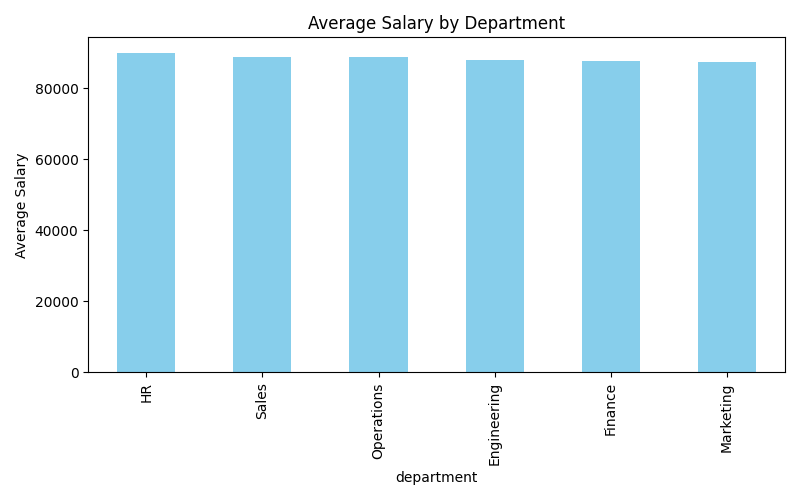</td> <td>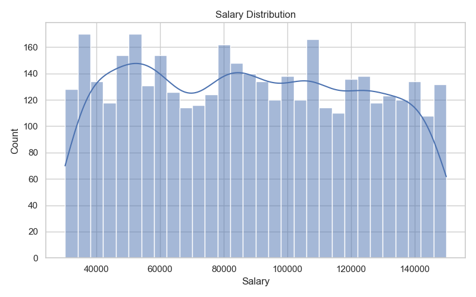</td></tr></table>
<table><tr><td>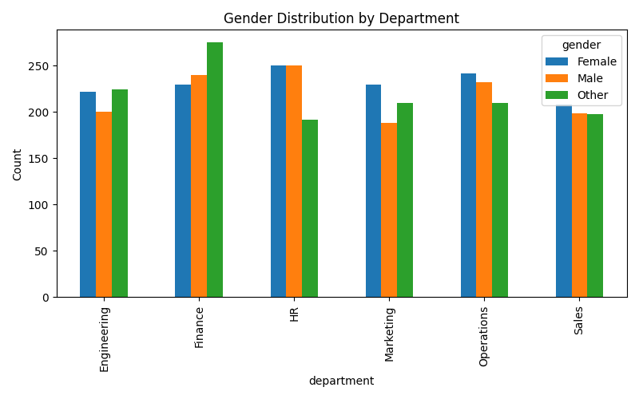</td> <td>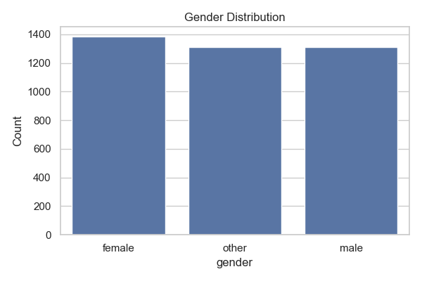</td></tr></table>
<table><tr><td>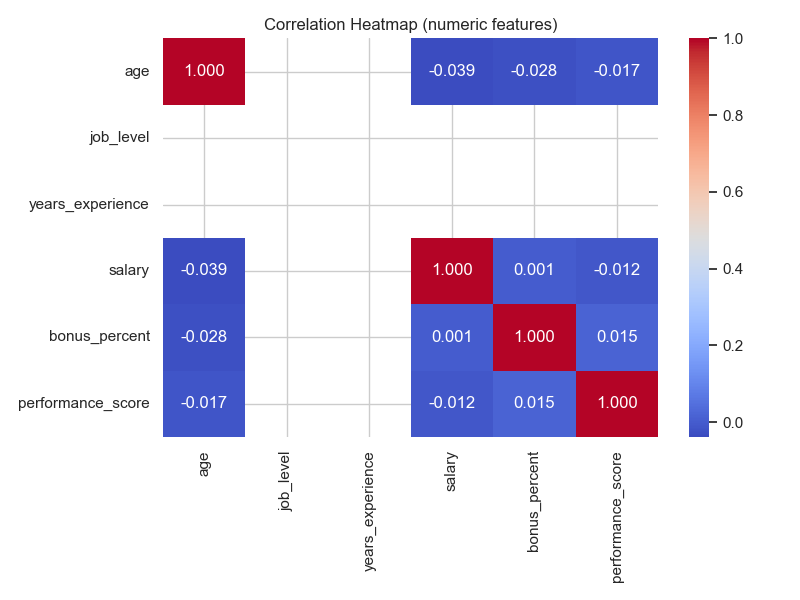</td> <td>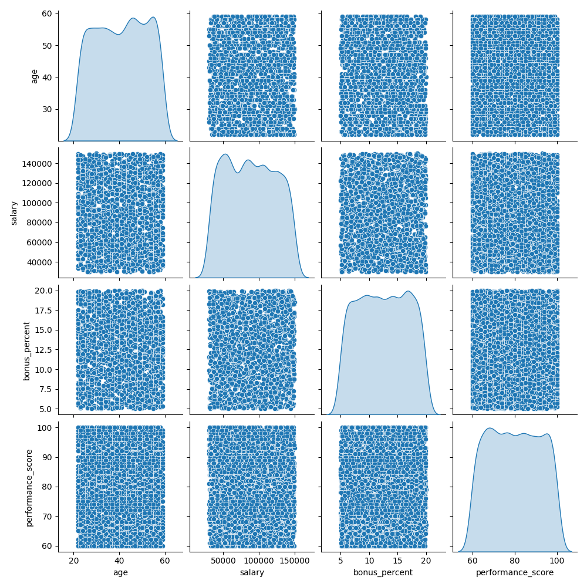</td></tr></table>
<table><tr><td>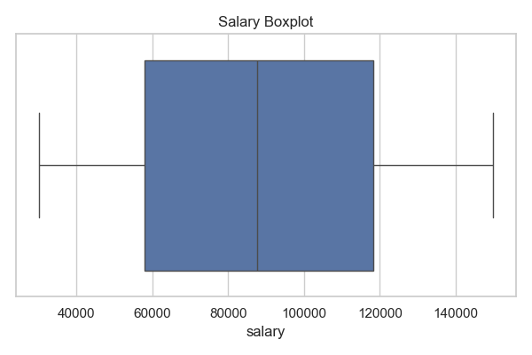</td> <td>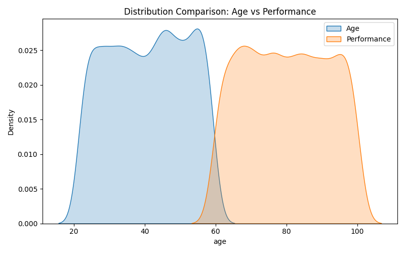</td></tr></table>
<table><tr><td>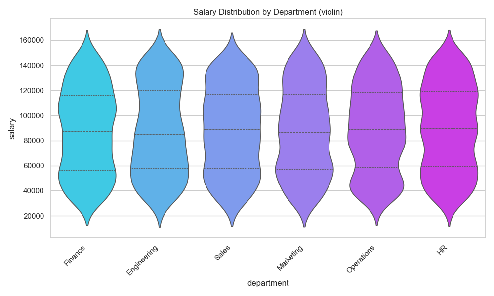</td> <td>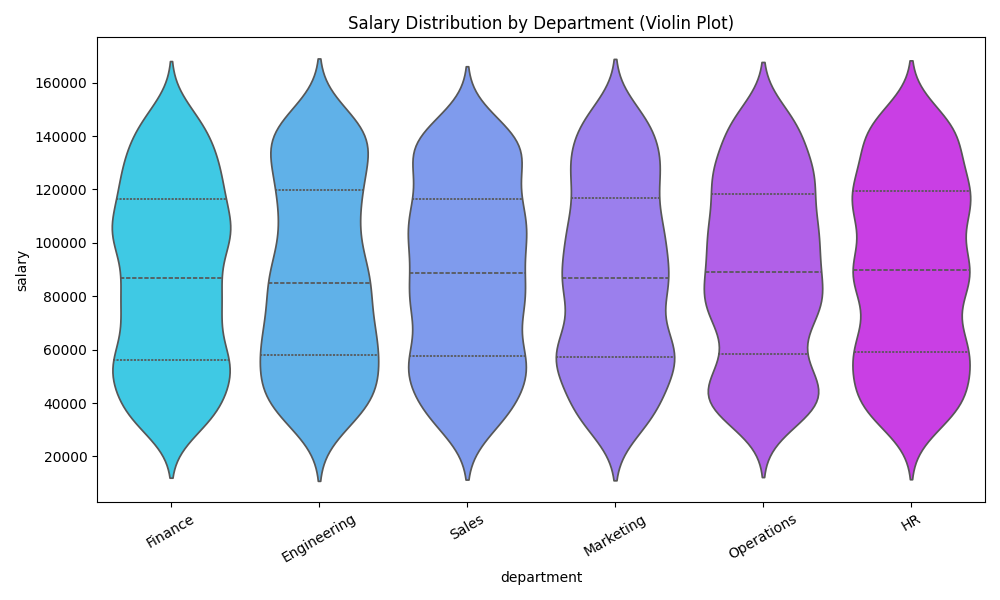</td></tr></table>
<table><tr><td>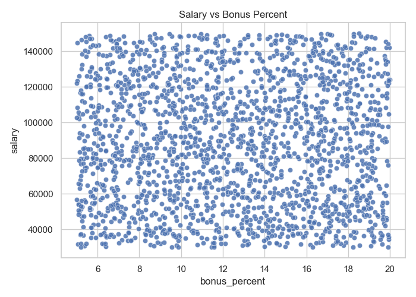</td> <td>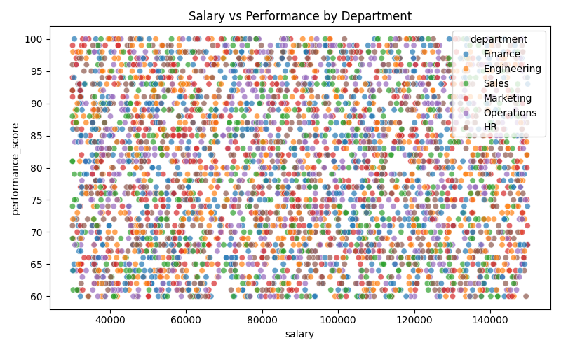</td></tr></table>
<table><tr><td>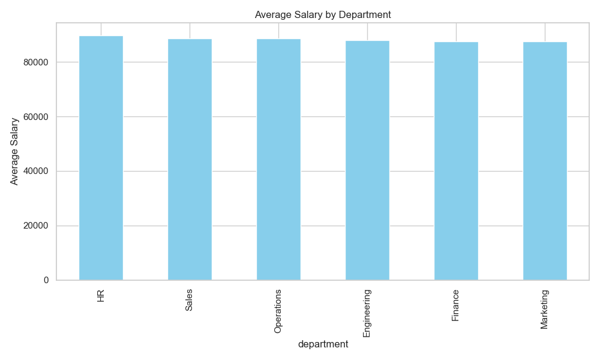</td> <td>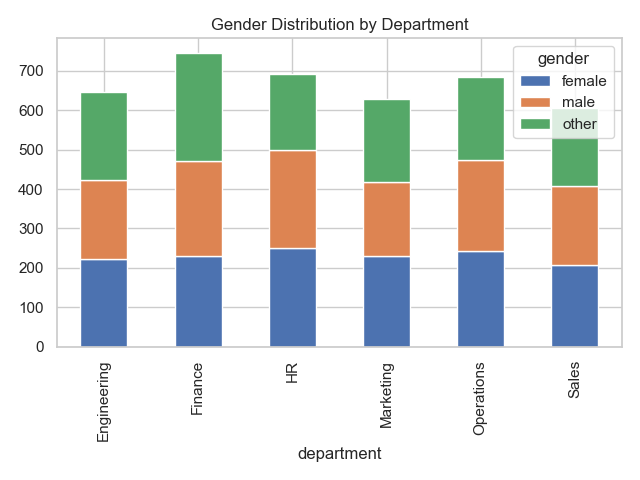</td></tr></table>

## Statistical Summary (Distribution Insights)

| Column | Mean | Median | Std | Skew | Kurtosis |
|:--|--:|--:|--:|--:|--:|
| age | 40.81 | 41.00 | 11.08 | −0.05 | −1.23 |
| salary | 88 360.85 | 87 713.00 | 34 462.23 | 0.06 | −1.19 |
| bonus_percent | 12.48 | 12.51 | 4.32 | −0.01 | −1.20 |
| performance_score | 79.93 | 80.00 | 11.81 | 0.02 | −1.20 |

*All key metrics show near-normal distribution with mild negative kurtosis (light tails).*

## Advanced Analysis 

<table><tr><td>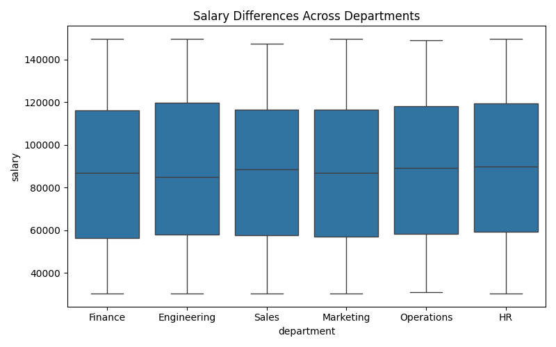</td> <td>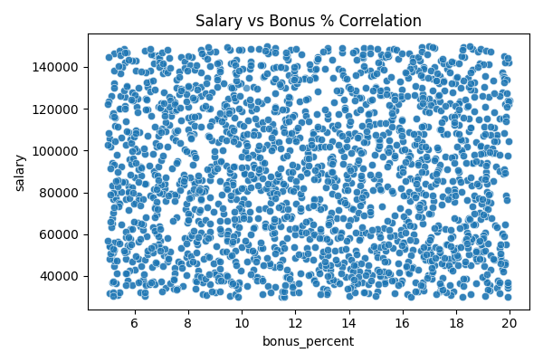</td></tr></table>
<table><tr><td>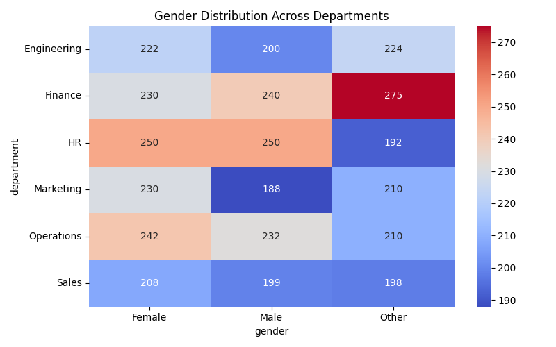</td> <td>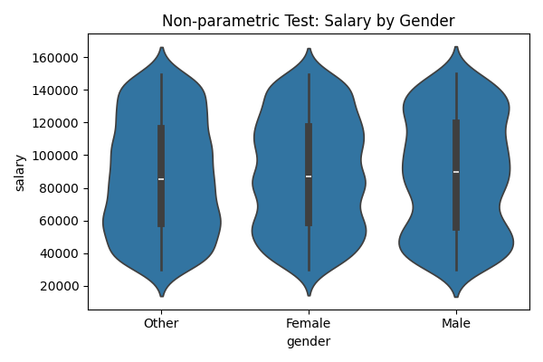</td></tr></table>
<table><tr><td>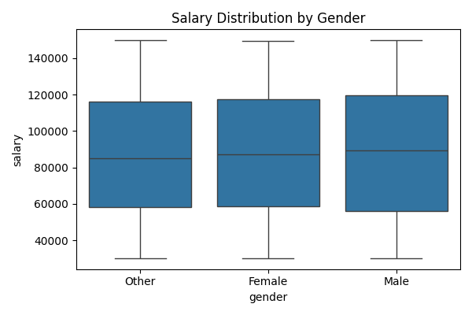</td> <td></td></tr></table>

## Hypothesis Testing Report

| Test | Statistic | P-Value | Result | Insight |
|:--|--:|--:|:--|:--|
| **ANOVA (Salary vs Department)** | F = 0.455 | 0.8102 | ❌ Not Significant | No salary difference across departments |
| **T-Test (Salary by Gender)** | t = −0.385 | 0.7004 | ❌ Not Significant | Gender has no impact on salary |
| **Chi-Square (Dept vs Gender)** | χ² = 20.201 | 0.0274 | ✅ Significant | Department & gender are related |
| **Correlation (Salary vs Bonus)** | r = 0.001 | 0.9430 | ❌ Not Significant | No linear relationship |
| **Mann-Whitney U (Non-parametric)** | U = 896 162 | 0.6783 | ❌ Not Significant | No rank-based difference detected |

## Team-level Insights

| Metric | Insight |
|:--|:--|
| **Total Teams** | 6 |
| **Departments** | Finance, Engineering, Sales, Marketing, Operations, HR |

| Average Salary by Department  | Gender Distribution by Department (Sample) |
|-------------------------------|--------------------------------------------|
| <table> <tr><th>Department</th><th>Avg Salary</th></tr><tr><td>HR</td><td>₹ 89 784</td></tr><tr><td>Sales</td><td>₹ 88 750</td></tr><tr><td>Operations</td><td>₹ 88 698</td></tr><tr><td>Engineering</td><td>₹ 87 941</td></tr><tr><td>Finance</td><td>₹ 87 533</td></tr><tr><td>Marketing</td><td>₹ 87 462</td></tr> </table> | <table> <tr><th>Department</th><th>Male</th><th>Female</th><th>Other</th></tr><tr><td>Engineering</td><td>222</td><td>200</td><td>224</td></tr><tr><td>Finance</td><td>230</td><td>240</td><td>275</td></tr><tr><td>HR</td><td>250</td><td>250</td><td>192</td></tr><tr><td>Marketing</td><td>230</td><td>188</td><td>210</td></tr><tr><td>Operations</td><td>242</td><td>232</td><td>210</td></tr><tr><td>Sales</td><td>208</td><td>199</td><td>198</td></tr> </table> |

## Key Insights

- **Salary equality** observed across genders and departments.  
- **No strong correlation** between salary and bonus percentage.  
- **Department–gender relationship exists**, suggesting departmental gender skew.  
- Data distribution shows balanced spread but incomplete job level & experience data.  
- Clean, modular codebase ready for **further ML or dashboard integration**.

## Business Insights & Recommendations
1. **Gender–Department Diversity**
* Significant relation (p=0.0274) → gender distribution varies by department.
* Action: Focus hiring diversity efforts in Engineering & Operations to achieve balance.

2. **Salary Equity Across Organization**
* No significant differences between departments or genders.
* Action: Maintain this fair pay structure as a strong employer-branding message.

3. **Bonus Structure**
* Salary and bonus have no correlation (r≈0).
* Action: Evaluate if the bonus system is effectively driving performance or needs restructuring.

4. **Departmental Averages**

| Department | Avg. Salary (₹) | Key Insight|
|:--|--:|--:|
| HR	| 89,784  | Highest average salary, likely senior positions |
| Sales | 88,750  | Incentive-driven compensation |
| Engineering / Operations	 | ~88,000 | Core technical stability|
| Finance / Marketing | ~87,000 | May require motivation or rewards review |

6. **Workforce Profile**
* Mid-aged (avg 41 years), high-performing (avg 80/100).
* Action: Introduce mentorship and leadership training to retain experience and motivate youth hires.

7. **Data Quality Gaps**
* Missing job_level, years_experience, first_name.
* Action: Enforce data validation and completeness checks in HR systems for accurate analytics.

## Project folder tree (Tree/f) 
D:.
│   .gitignore
│   LICENSE
│   main.py
│   README.md
│   requirements.txt
│   test.py
│   
├───.idea
│   │   .gitignore
│   │   EmployeeDataAnalysis_Insights_Trends_Visualization.iml
│   │   misc.xml
│   │   modules.xml
│   │   vcs.xml
│   │   workspace.xml
│   │   
│   └───inspectionProfiles
│           profiles_settings.xml
│           Project_Default.xml
│           
├───assets
├───data
│   │   employee_data.db
│   │   
│   ├───processed
│   │       employees_unified.csv
│   │       
│   └───raw
│           employees.csv
│           employees_cleaned_data.csv
│           employees_project_cleaned.csv
│           
├───notebooks
│       01_data_cleaning.ipynb
│       02_sql_analysis.ipynb
│       03_visualizations.ipynb
│       
├───outputs
│   ├───plots
│   │       avg_salary_by_department.png
│   │       correlation_heatmap.png
│   │       distribution_comparison.png
│   │       gender_distribution.png
│   │       gender_distribution_by_department.png
│   │       pairplot_relationships.png
│   │       salary_boxplot.png
│   │       salary_distribution.png
│   │       salary_violin_by_department.png
│   │       salary_violin_department.png
│   │       salary_vs_bonus.png
│   │       salary_vs_performance.png
│   │       team_avg_salary_by_department.png
│   │       team_gender_distribution_by_department.png
│   │       
│   └───reports
│           eda_summary.txt
│           hypothesis_testing_report.txt
│           statistical_summary.csv
│           team_analysis_report.txt
│           
├───reports
│       insights_summary.md
│       
├───scripts
├───sql
│   │   create_schema.sql
│   │   
│   └───queries
│           avg_salary_by_dept.sql
│           gender_distribution.sql
│           top_performers.sql
│           
├───src
│   ├───analysis
│   │       run_sql_queries.py
│   │       summary_insights.py
│   │       
│   ├───etl
│   │   │   clean_data.py
│   │   │   data_cleaning_methods_demo.py
│   │   │   to_sql.py
│   │   │   
│   │   └───data
│   │       └───processed
│   ├───outputs
│   │   ├───plots
│   │   │       anova_salary_by_department.png
│   │   │       chi_square_department_gender.png
│   │   │       correlation_salary_bonus.png
│   │   │       mannwhitney_salary_by_gender.png
│   │   │       ttest_salary_by_gender.png
│   │   │       
│   │   └───reports
│   │           hypothesis_testing_report.txt
│   │           
│   └───viz
│           charts.py
│           
└───visualizations
    │   basic_visualizations.py
    │   basic_visualizations_1.py
    │   basic_visualizations_2.py
    │   
    └───outputs
        ├───plots
        │       avg_salary_by_department.png
        │       correlation_heatmap.png
        │       gender_distribution.png
        │       gender_distribution_by_department.png
        │       salary_boxplot.png
        │       salary_distribution.png
        │       salary_violin_by_department.png
        │       salary_vs_bonus.png
        │       
        └───reports
                eda_summary.txt
                hypothesis_testing.txt
                hypothesis_testing_report.txt
                statistical_summary.csv
                team_analysis.csv

## PythonFile for Execution this Project
### See other files(.sqlfiles, reports etc.) also in folders
```
python

# visualizations/basic_visualizations.py
"""
Professional single-file pipeline for Employee Data Analysis:
- Loads processed dataset (employees_unified.csv)
- Runs EDA and saves eda_summary.txt
- Generates & saves basic visualizations (also displays them)
- Runs statistical summaries and saves statistical_summary.csv
- Runs advanced statistical analysis (correlation, ANOVA, violin plots)
- Runs hypothesis tests and saves hypothesis_testing_report.txt
- Runs team-level analyses and saves plots & report
- Minimal, clean console output with section timings
- Uses only standard data-science libraries + colorama for colored but professional logs
"""

import time
from pathlib import Path
import warnings
import pandas as pd
import numpy as np
import matplotlib.pyplot as plt
import seaborn as sns
from scipy import stats
from colorama import init as colorama_init, Fore, Style
from datetime import datetime

# Initialize colorama (keeps output professional and readable)
colorama_init(autoreset=True)
# Suppress numpy/pandas runtime warnings that don't affect outputs
warnings.filterwarnings("ignore")

# -----------------------
# Configuration / Paths
# -----------------------
BASE_DIR = Path.cwd()

DATA_PATH = BASE_DIR / "data" / "processed" / "employees_unified.csv"

OUTPUT_PLOTS = BASE_DIR / "outputs" / "plots"
OUTPUT_REPORTS = BASE_DIR / "outputs" / "reports"

# Create output directories if missing
OUTPUT_PLOTS.mkdir(parents=True, exist_ok=True)
OUTPUT_REPORTS.mkdir(parents=True, exist_ok=True)

# Matplotlib styling
sns.set(style="whitegrid")

# -----------------------
# Utility helpers
# -----------------------
def _log(msg: str, level: str = "info"):
    """Minimal colored logging: info, ok, warn, err."""
    if level == "ok":
        print(Fore.GREEN + msg + Style.RESET_ALL)
    elif level == "warn":
        print(Fore.YELLOW + msg + Style.RESET_ALL)
    elif level == "err":
        print(Fore.RED + msg + Style.RESET_ALL)
    else:
        print(msg)


def _timeit(func):
    """Decorator to print start/end and duration for steps."""
    def wrapper(*args, **kwargs):
        name = func.__name__.replace("_", " ").title()
        _log(f"STEP: {name} - started", "info")
        t0 = time.perf_counter()
        result = func(*args, **kwargs)
        t1 = time.perf_counter()
        _log(f"STEP: {name} - completed in {t1 - t0:.2f}s", "ok")
        print("")  # blank line between steps
        return result
    return wrapper


# -----------------------
# Core pipeline pieces
@_timeit
def load_data(path: Path) -> pd.DataFrame:
    if not path.exists():
        raise FileNotFoundError(f"Processed file not found at: {path}")
    df = pd.read_csv(path)
    # Basic canonicalization: lower-case column names and strip
    df.columns = [c.strip().lower().replace(" ", "_") for c in df.columns]
    return df


@_timeit
def exploratory_data_analysis(df: pd.DataFrame) -> None:
    """Saves a compact EDA summary to outputs/reports/eda_summary.txt"""
    numeric_cols = df.select_dtypes(include=[np.number]).columns.tolist()
    categorical_cols = [c for c in df.columns if c not in numeric_cols]

    lines = []
    lines.append("Exploratory Data Analysis (EDA) Summary")
    lines.append("=" * 60)
    lines.append(f"Rows: {len(df)}, Columns: {len(df.columns)}")
    lines.append(f"Numeric columns: {numeric_cols}")
    lines.append(f"Categorical columns: {categorical_cols}")
    lines.append("")

    # Numeric summaries
    if numeric_cols:
        lines.append("Numeric summaries (mean, median, std, min, max, non-null):")
        for col in numeric_cols:
            s = df[col].dropna()
            if s.empty:
                lines.append(f"{col}: no valid numeric values")
                continue
            lines.append(
                f"{col}: mean={s.mean():.2f}, median={s.median():.2f}, std={s.std():.2f}, "
                f"min={s.min():.2f}, max={s.max():.2f}, count={s.count()}"
            )
        lines.append("")

    # Categorical summaries (top values)
    if categorical_cols:
        lines.append("Categorical summaries (top 3 values):")
        for col in categorical_cols:
            top = df[col].value_counts(dropna=True).head(3)
            top_str = "; ".join([f"{idx}({val})" for idx, val in top.items()])
            lines.append(f"{col}: {top_str}")
        lines.append("")

    # Missing values overview
    lines.append("Missing values (per column):")
    mv = df.isna().sum()
    for col, cnt in mv.items():
        if cnt > 0:
            lines.append(f"{col}: {cnt}")

    # Write to file
    out = OUTPUT_REPORTS / "eda_summary.txt"
    with out.open("w", encoding="utf-8") as f:
        f.write("\n".join(lines))

    _log(f"EDA summary written: {out}", "ok")

@_timeit
def basic_visualizations(df: pd.DataFrame, show: bool = True) -> None:
    """Generate and save basic visualizations. Optionally plt.show() them."""
    # Salary distribution histogram
    if "salary" in df.columns:
        plt.figure(figsize=(8, 5))
        sns.histplot(df["salary"].dropna(), bins=30, kde=True)
        plt.title("Salary Distribution")
        plt.xlabel("Salary")
        plt.tight_layout()
        p = OUTPUT_PLOTS / "salary_distribution.png"
        plt.savefig(p)
        if show:
            plt.show()
        plt.close()
        _log(f"Saved: {p}", "ok")

        # Boxplot
        plt.figure(figsize=(6, 4))
        sns.boxplot(x=df["salary"].dropna())
        plt.title("Salary Boxplot")
        plt.tight_layout()
        p = OUTPUT_PLOTS / "salary_boxplot.png"
        plt.savefig(p)
        if show:
            plt.show()
        plt.close()
        _log(f"Saved: {p}", "ok")

    # Salary vs Bonus scatter
    if {"salary", "bonus_percent"}.issubset(df.columns):
        plt.figure(figsize=(7, 5))
        sns.scatterplot(x="bonus_percent", y="salary", data=df, alpha=0.6)
        plt.title("Salary vs Bonus Percent")
        plt.tight_layout()
        p = OUTPUT_PLOTS / "salary_vs_bonus.png"
        plt.savefig(p)
        if show:
            plt.show()
        plt.close()
        _log(f"Saved: {p}", "ok")

    # Gender distribution bar
    if "gender" in df.columns:
        plt.figure(figsize=(6, 4))
        vc = df["gender"].value_counts(dropna=True)
        sns.barplot(x=vc.index, y=vc.values)
        plt.title("Gender Distribution")
        plt.ylabel("Count")
        plt.tight_layout()
        p = OUTPUT_PLOTS / "gender_distribution.png"
        plt.savefig(p)
        if show:
            plt.show()
        plt.close()
        _log(f"Saved: {p}", "ok")

@_timeit
def statistical_summary(df: pd.DataFrame) -> pd.DataFrame:
    """Create a CSV summary for numeric columns (mean, median, std, skew, kurt)."""
    numeric_cols = df.select_dtypes(include=[np.number]).columns.tolist()
    rows = []
    for col in numeric_cols:
        s = df[col].dropna()
        if s.empty:
            continue
        rows.append({
            "column": col,
            "mean": s.mean(),
            "median": s.median(),
            "std": s.std(),
            "skew": s.skew(),
            "kurtosis": s.kurt()
        })
    summary_df = pd.DataFrame(rows)
    out = OUTPUT_REPORTS / "statistical_summary.csv"
    summary_df.to_csv(out, index=False)
    _log(f"Statistical summary saved: {out}", "ok")
    return summary_df


@_timeit
def advanced_statistical_analysis(df: pd.DataFrame, show: bool = True) -> None:
    """
    Correlation matrix, ANOVA across departments (salary),
    violin plot per department, and a correlation pair check.
    """
    # Correlation matrix
    numeric_df = df.select_dtypes(include=[np.number])
    if not numeric_df.empty:
        corr = numeric_df.corr()
        _log("Correlation matrix (numeric columns):", "info")
        print(corr.to_string())
        plt.figure(figsize=(8, 6))
        sns.heatmap(corr, annot=True, cmap="coolwarm", fmt=".3f")
        plt.title("Correlation Heatmap (numeric features)")
        plt.tight_layout()
        p = OUTPUT_PLOTS / "correlation_heatmap.png"
        plt.savefig(p)
        if show:
            plt.show()
        plt.close()
        _log(f"Saved: {p}", "ok")

    # Violin plot salary by department
    if {"department", "salary"}.issubset(df.columns):
        plt.figure(figsize=(10, 6))
        sns.violinplot(x="department", y="salary", data=df, inner="quartile", palette="cool")
        plt.title("Salary Distribution by Department (violin)")
        plt.xticks(rotation=45, ha="right")
        plt.tight_layout()
        p = OUTPUT_PLOTS / "salary_violin_by_department.png"
        plt.savefig(p)
        if show:
            plt.show()
        plt.close()
        _log(f"Saved: {p}", "ok")

        # ANOVA: salary across departments
        groups = [g["salary"].dropna().values for _, g in df.groupby("department") if not g["salary"].dropna().empty]
        if len(groups) > 1:
            f_stat, p_val = stats.f_oneway(*groups)
            _log(f"ANOVA (salary by department): F={f_stat:.4f}, p={p_val:.4f}", "info")
        else:
            _log("ANOVA not performed: not enough groups with data.", "warn")

    # Additional advanced checks: correlation between years_experience and performance_score
    if {"years_experience", "performance_score"}.issubset(df.columns):
        xe = df["years_experience"].dropna()
        yp = df["performance_score"].dropna()
        # align indexes
        common_idx = xe.index.intersection(yp.index)
        if len(common_idx) > 0:
            r, p = stats.pearsonr(xe.loc[common_idx], yp.loc[common_idx])
            _log(f"Pearson r (years_experience vs performance_score): r={r:.4f}, p={p:.4f}", "info")
        else:
            _log("No overlapping data for experience vs performance correlation.", "warn")

# === Utility Decorator & Logger ===
def _timeit(func):
    def wrapper(*args, **kwargs):
        start = datetime.now()
        result = func(*args, **kwargs)
        end = datetime.now()
        duration = (end - start).total_seconds()
        print(f"\n⏱️ {func.__name__} completed in {duration:.2f}s\n")
        return result
    return wrapper

def _log(message: str, status="info"):
    tag = {"ok": "✅", "warn": "⚠️", "err": "❌"}.get(status, "ℹ️")
    print(f"{tag} {message}")

# === Output Folder Setup ===
OUTPUT_REPORTS = Path("outputs/reports")
OUTPUT_REPORTS.mkdir(parents=True, exist_ok=True)

# === Hypothesis Testing Function ===
@_timeit
def hypothesis_tests(df: pd.DataFrame) -> None:
    """Perform multiple hypothesis tests and save a textual report."""
    lines = []
    lines.append("🧠 EMPLOYEE HYPOTHESIS TESTING REPORT")
    lines.append("=" * 60)

    # ANOVA Test: Salary difference across departments
    if {"department", "salary"}.issubset(df.columns):
        try:
            anova = stats.f_oneway(
                *[df.loc[df["department"] == d, "salary"].dropna()
                  for d in df["department"].unique()]
            )
            conclusion = "Reject H0 (Significant difference)" if anova.pvalue < 0.05 else "Fail to Reject H0"
            lines.append("\n[ANOVA Test: Salary by Department]")
            lines.append(f"F-statistic = {anova.statistic:.3f}, p-value = {anova.pvalue:.4f}, conclusion = {conclusion}")
        except Exception as e:
            lines.append(f"ANOVA Test Error: {e}")
    else:
        lines.append("ANOVA skipped (missing department or salary column).")

    # T-Test: Salary by Gender
    if {"gender", "salary"}.issubset(df.columns):
        male = df.loc[df["gender"].str.lower() == "male", "salary"].dropna()
        female = df.loc[df["gender"].str.lower() == "female", "salary"].dropna()
        if len(male) > 1 and len(female) > 1:
            t_stat, p_val = stats.ttest_ind(male, female, equal_var=False)
            conclusion = "Reject H0 (Significant difference)" if p_val < 0.05 else "Fail to Reject H0"
            lines.append("\n[T-Test: Salary by Gender]")
            lines.append(f"T-statistic = {t_stat:.3f}, p-value = {p_val:.4f}, conclusion = {conclusion}")
        else:
            lines.append("T-Test skipped (not enough gender samples).")
    else:
        lines.append("T-Test skipped (gender/salary missing).")

    # Chi-Square Test: Department vs Gender
    if {"department", "gender"}.issubset(df.columns):
        contingency = pd.crosstab(df["department"], df["gender"])
        try:
            chi2, p, dof, exp = stats.chi2_contingency(contingency)
            conclusion = "Reject H0 (Relationship exists)" if p < 0.05 else "Fail to Reject H0"
            lines.append("\n[Chi-Square Test: Department vs Gender]")
            lines.append(f"Chi2 = {chi2:.3f}, p-value = {p:.4f}, conclusion = {conclusion}")
        except Exception as e:
            lines.append(f"Chi-Square Test Error: {e}")
    else:
        lines.append("Chi-Square skipped (department/gender missing).")

    # Correlation: Salary vs Bonus
    if {"salary", "bonus"}.issubset(df.columns):
        corr, p_corr = stats.pearsonr(df["salary"], df["bonus"])
        conclusion = "Reject H0 (Significant correlation)" if p_corr < 0.05 else "Fail to Reject H0"
        lines.append("\n[Correlation: Salary vs Bonus]")
        lines.append(f"Pearson r = {corr:.3f}, p-value = {p_corr:.4f}, conclusion = {conclusion}")
    else:
        lines.append("Correlation skipped (salary/bonus missing).")

    # Mann-Whitney U Test (Non-parametric)
    if {"gender", "salary"}.issubset(df.columns):
        male = df.loc[df["gender"].str.lower() == "male", "salary"].dropna()
        female = df.loc[df["gender"].str.lower() == "female", "salary"].dropna()
        if len(male) > 1 and len(female) > 1:
            u_stat, p_u = stats.mannwhitneyu(male, female)
            conclusion = "Reject H0 (Difference detected)" if p_u < 0.05 else "Fail to Reject H0"
            lines.append("\n[Mann-Whitney U Test]")
            lines.append(f"U-statistic = {u_stat:.3f}, p-value = {p_u:.4f}, conclusion = {conclusion}")
        else:
            lines.append("Mann-Whitney U skipped (insufficient samples).")
    else:
        lines.append("Mann-Whitney skipped (gender/salary missing).")

    # === Write to Report File ===
    out = OUTPUT_REPORTS / "hypothesis_testing_report.txt"
    with out.open("w", encoding="utf-8") as f:
        f.write("\n".join(lines))

    _log(f"Hypothesis Testing Report saved at: {out}", "ok")

# Example run:
# df = pd.read_csv("data/cleaned_employee_data.csv")
# hypothesis_tests(df)

# === Utility Decorator & Logger ===
def _timeit(func):
    def wrapper(*args, **kwargs):
        start = datetime.now()
        result = func(*args, **kwargs)
        end = datetime.now()
        duration = (end - start).total_seconds()
        print(f"\n⏱️ {func.__name__} completed in {duration:.2f}s\n")
        return result
    return wrapper

def _log(message: str, status="info"):
    tag = {"ok": "✅", "warn": "⚠️", "err": "❌"}.get(status, "ℹ️")
    print(f"{tag} {message}")

# === Output Folder Setup ===
OUTPUT_REPORTS = Path("outputs/reports")
OUTPUT_REPORTS.mkdir(parents=True, exist_ok=True)

# === Hypothesis Testing Function ===
@_timeit
def hypothesis_tests(df: pd.DataFrame) -> None:
    """Perform multiple hypothesis tests and save a textual report."""
    lines = []
    lines.append("🧠 EMPLOYEE HYPOTHESIS TESTING REPORT")
    lines.append("=" * 60)

    # ANOVA Test: Salary difference across departments
    if {"department", "salary"}.issubset(df.columns):
        try:
            anova = stats.f_oneway(
                *[df.loc[df["department"] == d, "salary"].dropna()
                  for d in df["department"].unique()]
            )
            conclusion = "Reject H0 (Significant difference)" if anova.pvalue < 0.05 else "Fail to Reject H0"
            lines.append("\n[ANOVA Test: Salary by Department]")
            lines.append(f"F-statistic = {anova.statistic:.3f}, p-value = {anova.pvalue:.4f}, conclusion = {conclusion}")
        except Exception as e:
            lines.append(f"ANOVA Test Error: {e}")
    else:
        lines.append("ANOVA skipped (missing department or salary column).")

    # T-Test: Salary by Gender
    if {"gender", "salary"}.issubset(df.columns):
        male = df.loc[df["gender"].str.lower() == "male", "salary"].dropna()
        female = df.loc[df["gender"].str.lower() == "female", "salary"].dropna()
        if len(male) > 1 and len(female) > 1:
            t_stat, p_val = stats.ttest_ind(male, female, equal_var=False)
            conclusion = "Reject H0 (Significant difference)" if p_val < 0.05 else "Fail to Reject H0"
            lines.append("\n[T-Test: Salary by Gender]")
            lines.append(f"T-statistic = {t_stat:.3f}, p-value = {p_val:.4f}, conclusion = {conclusion}")
        else:
            lines.append("T-Test skipped (not enough gender samples).")
    else:
        lines.append("T-Test skipped (gender/salary missing).")

    # Chi-Square Test: Department vs Gender
    if {"department", "gender"}.issubset(df.columns):
        contingency = pd.crosstab(df["department"], df["gender"])
        try:
            chi2, p, dof, exp = stats.chi2_contingency(contingency)
            conclusion = "Reject H0 (Relationship exists)" if p < 0.05 else "Fail to Reject H0"
            lines.append("\n[Chi-Square Test: Department vs Gender]")
            lines.append(f"Chi2 = {chi2:.3f}, p-value = {p:.4f}, conclusion = {conclusion}")
        except Exception as e:
            lines.append(f"Chi-Square Test Error: {e}")
    else:
        lines.append("Chi-Square skipped (department/gender missing).")

    # Correlation: Salary vs Bonus
    if {"salary", "bonus"}.issubset(df.columns):
        corr, p_corr = stats.pearsonr(df["salary"], df["bonus"])
        conclusion = "Reject H0 (Significant correlation)" if p_corr < 0.05 else "Fail to Reject H0"
        lines.append("\n[Correlation: Salary vs Bonus]")
        lines.append(f"Pearson r = {corr:.3f}, p-value = {p_corr:.4f}, conclusion = {conclusion}")
    else:
        lines.append("Correlation skipped (salary/bonus missing).")

    # Mann-Whitney U Test (Non-parametric)
    if {"gender", "salary"}.issubset(df.columns):
        male = df.loc[df["gender"].str.lower() == "male", "salary"].dropna()
        female = df.loc[df["gender"].str.lower() == "female", "salary"].dropna()
        if len(male) > 1 and len(female) > 1:
            u_stat, p_u = stats.mannwhitneyu(male, female)
            conclusion = "Reject H0 (Difference detected)" if p_u < 0.05 else "Fail to Reject H0"
            lines.append("\n[Mann-Whitney U Test]")
            lines.append(f"U-statistic = {u_stat:.3f}, p-value = {p_u:.4f}, conclusion = {conclusion}")
        else:
            lines.append("Mann-Whitney U skipped (insufficient samples).")
    else:
        lines.append("Mann-Whitney skipped (gender/salary missing).")

    # === Write to Report File ===
    out = OUTPUT_REPORTS / "hypothesis_testing_report.txt"
    with out.open("w", encoding="utf-8") as f:
        f.write("\n".join(lines))
    _log(f"Hypothesis Testing Report saved at: {out}", "ok")

# Example run:
# df = pd.read_csv("data/cleaned_employee_data.csv")
# hypothesis_tests(df)


def main(show_plots: bool = True):
    total_start = time.perf_counter()
    _log("Employee Data Analysis pipeline starting...", "info")

    # Load
    df = load_data(DATA_PATH)

    # Clean a few expected columns: ensure lower-case gender/department
    if "gender" in df.columns:
        df["gender"] = df["gender"].astype(str).str.strip().str.lower()
    if "department" in df.columns:
        df["department"] = df["department"].astype(str).str.strip()

    exploratory_data_analysis(df)
    basic_visualizations(df, show=show_plots)
    statistical_summary(df)
    advanced_statistical_analysis(df, show=show_plots)
    hypothesis_tests(df)

    total_end = time.perf_counter()
    _log(f"Pipeline completed in {total_end - total_start:.2f} seconds", "ok")


if __name__ == "__main__":
    # show_plots=True will both save and display each plot (good for PyCharm)
    main(show_plots=True)


```


## How to Run the Project
* Clone the repository: git clone https://github.com/sunilprajapati832/EmployeeDataAnalysis_Insights_Trends_Visualization.git
* Install dependencies: pip install -r requirements.txt
* Run notebooks or scripts from the /notebooks or /scripts folder.

## About Me
I'm Sunil Prajapati — a data analyst, machine learning enthusiast and educational content creator. This project reflects my growth from beginner to practitioner and my passion for turning data into insights.
If you found this project interesting, let’s connect!  

[](https://www.linkedin.com/in/sunil-prajapati832)

---
🛠 Built by: Sunil Prajapati |  Github + Data + Python + PyCharm + Canva 
---


